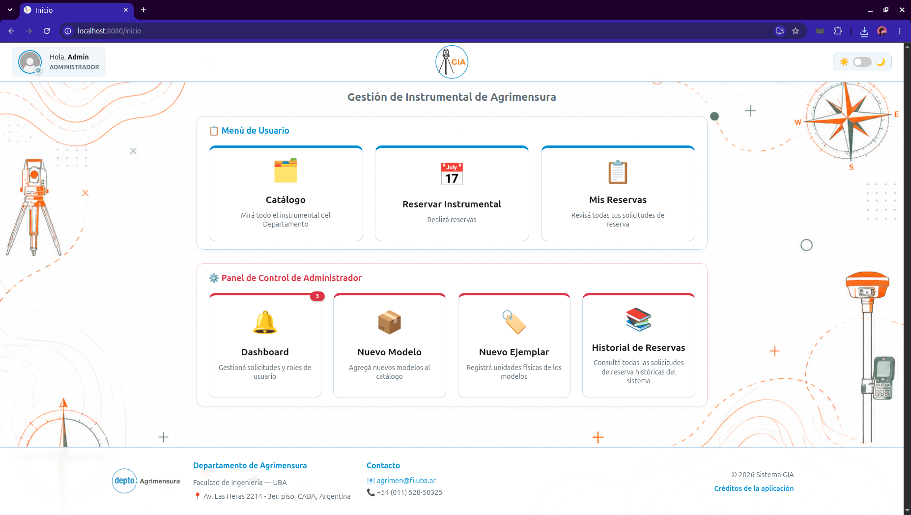
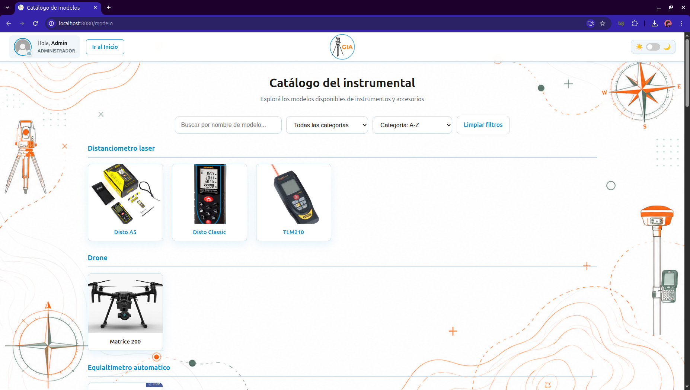
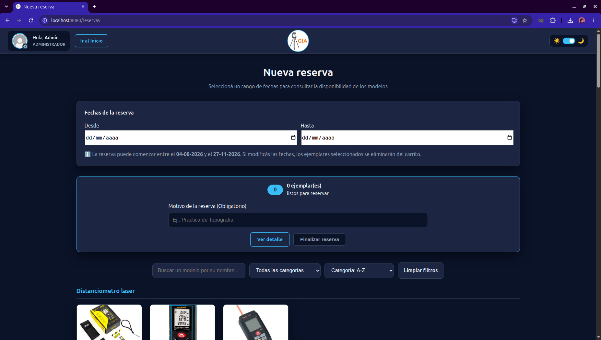
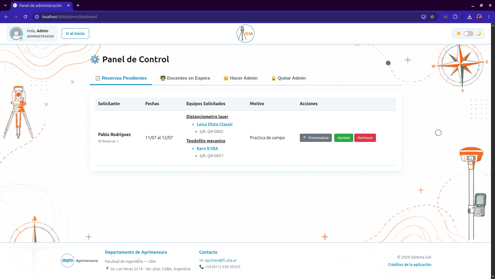
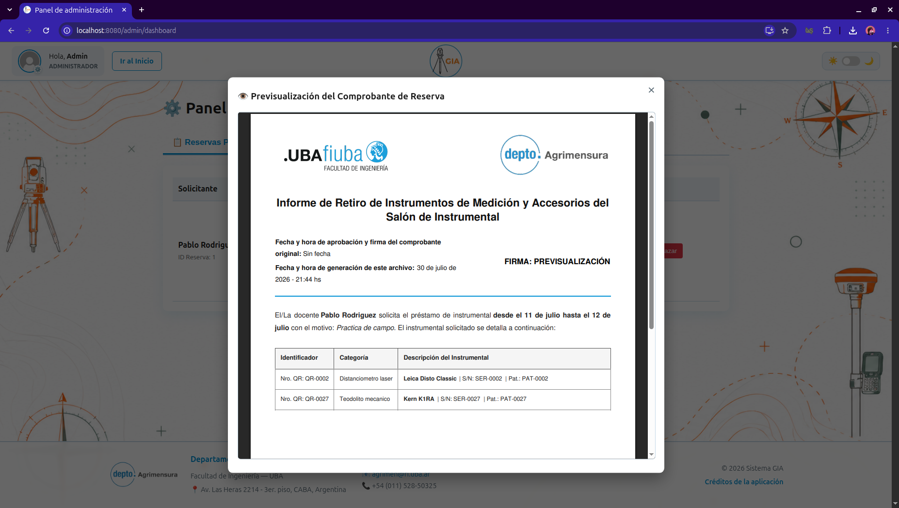

# 🎻 Sistema GIA — Gestión de Instrumental de Agrimensura

> Plataforma web para la administración y reserva del instrumental del Departamento de Agrimensura (FIUBA): catálogo de equipos, reservas, aprobaciones y comprobantes con firma institucional. Construida en **Rust** con arquitectura en capas.




---

## 📌 ¿Qué es esto?

El **Sistema GIA** es una aplicación web full-stack que digitaliza el préstamo de instrumental de agrimensura (distanciómetros, teodolitos, drones, GPS, etc.) del Departamento de Agrimensura de FIUBA. Los docentes pueden explorar el catálogo, reservar equipos por rango de fechas y hacer seguimiento de sus solicitudes; los administradores gestionan las solicitudes de préstamo y el registro y roles de los usuarios. Al aprobarse una solicitud de reserva se genera un comprobante de retiro automáticamente, que es enviado por el servicio de mail de la app al solicitante.

Fue desarrollado como proyecto de la materia *Taller de Programación* de la FIUBA durante el 1er cuatrimestre de 2026, con foco en aplicar buenas prácticas de arquitectura de software, testing automatizado y despliegue con Docker.

### Funcionalidades principales

- 🔐 Registro, inicio de sesión y restablecimiento de contraseña, con modo invitado para solo consultar el catálogo
- 📦 Catálogo de modelos y ejemplares filtrable y ordenable por categoría con búsqueda
- 📅 Reserva de instrumental por rango de fechas, con detección de disponibilidad
- 🛠️ Panel de administración: aprobar/rechazar solicitudes, gestionar roles de docentes/admins
- 🧾 Generación automática de comprobantes de retiro en PDF
- 📧 Notificaciones por mail (registro, aprobación/rechazo de reservas con PDF adjunto, restablecimiento de contraseña) vía SMTP con Mailtrap
- 📊 Historial de reservas con filtros, orden y exportación a CSV
- 🌗 Modo claro/oscuro
- 📝 Logger dual (archivo + consola) para trazabilidad de eventos

### Capturas

| Catálogo de instrumental | Nueva reserva |
|---|---|
|  |  |

**Panel de administración** — aprobación de solicitudes y generación de comprobantes en PDF:

| Panel de Control | Comprobante en PDF |
|---|---|
|  |  |

---

## 🧱 Stack tecnológico

| Capa | Tecnología |
|---|---|
| Lenguaje | Rust |
| Servidor HTTP | [Rouille](https://github.com/tomaka/rouille) |
| Base de datos | SQLite + [Rusqlite](https://github.com/rusqlite/rusqlite) |
| Templates | [Tera](https://tera.netlify.app/) |
| Interactividad | [HTMX](https://htmx.org/) |
| Email transaccional | [Lettre](https://lettre.rs/) (SMTP vía Mailtrap) |
| Infraestructura | Docker / Docker Compose (multi-stage build) |
| CI | GitHub Actions |

---

## 🏗️ Arquitectura

El proyecto sigue una **arquitectura en capas**, separando responsabilidades para mantener el código testeable y desacoplado:

```
Cliente (HTMX + Tera)
        │
        ▼
   routes/        → definición de endpoints
        │
        ▼
   handlers/      → manejo de requests y responses HTTP
        │
        ▼
   service/       → lógica de negocio
        │
        ▼
   repository/    → acceso a base de datos
        │
        ▼
   models/        → estructuras de dominio
        │
        ▼
     SQLite
```

Esta separación permite testear la lógica de negocio (`service/`) de forma aislada del acceso a datos (`repository/`) y de la capa HTTP (`handlers/`), y facilita reemplazar cualquiera de las capas sin afectar al resto.

---

## 🚀 Empezar

### Opción A — Con Docker (recomendado)

**Requisitos:** Docker y Docker Compose instalados.

1. Configurar variables de entorno. Crear un archivo `.env` en `gia/`:

   ```env
   ADDRESS=0.0.0.0:8080
   DB_PATH=data/gia.db
   MAILTRAP_USER=tu_usuario_aqui
   MAILTRAP_PASSWORD=tu_password_aqui
   ```

   > El archivo `.env` está ignorado en Git por seguridad y no debe subirse al repositorio.

2. Construir e iniciar el ambiente:

   ```bash
   docker-compose up --build -d
   ```

   La aplicación queda disponible en `http://localhost:8080/inicio`.

3. Ver logs en tiempo real (el sistema implementa un logger dual: archivo persistente `data/gia.log` + consola):

   ```bash
   docker-compose logs -f
   ```

4. Detener el ambiente (los datos en `/data` persisten gracias a los volúmenes configurados):

   ```bash
   docker-compose down
   ```

<details>
<summary>💡 Nota para usuarios de Linux (Ubuntu/Debian)</summary>

Si al ejecutar comandos de Docker aparece un error de "Permiso denegado" o el sistema obliga a usar `sudo` en cada paso:

```bash
sudo systemctl enable --now docker
sudo usermod -aG docker $USER
```

Después de este comando hay que cerrar sesión y volver a entrar (o reiniciar) para que los permisos se apliquen.

</details>

### Opción B — Desarrollo local (sin Docker)

**Requisitos:** Rust y Cargo instalados.

```bash
# Instalar dependencias del sistema
chmod +x setup.sh && ./setup.sh

# Variables de entorno necesarias
export LIBRARY_PATH=/usr/local/lib:$LIBRARY_PATH
export LD_LIBRARY_PATH=/usr/local/lib:$LD_LIBRARY_PATH

# Compilar
cargo build

# Ejecutar
cargo run
```

Luego abrir `http://localhost:8080/inicio` en el navegador.

### Tests

```bash
cargo test
```

> ⚠️ Varios tests de envío de mail están marcados como `#[ignore]`, ya que ejecutan contra el SMTP real de Mailtrap y su cuota gratuita es limitada. Para correr la suite completa, incluyéndolos:
>
> ```bash
> cargo test -- --include-ignored
> ```

---

## 🔧 Desarrollo

### Git hooks (pre-commit)

Para automatizar formateo y validación antes de cada commit:

```bash
chmod +x githooks/pre-commit
git config core.hooksPath githooks
```

El hook ejecuta automáticamente `cargo fmt`, `cargo clippy` y `cargo test` antes de permitir un commit.

---

## 👥 Equipo — Grupo 8: Bugbusters

| Nombre | Email | Padrón |
|---|---|---|
| Franco Lamas | flamas@fi.uba.ar | 112306 |
| Gerónimo Fanti | gfanti@fi.uba.ar | 109712 |
| Oliverio Mourier | omourier@fi.uba.ar | 106758 |
| Matias Ezequiel Dundic | mdundic@fi.uba.ar | 110773 |

### Mi contribución

Como parte del equipo, mi trabajo se centró en:

- **Diseño y modelado de la base de datos** (SQLite), definiendo el esquema relacional para usuarios, modelos, ejemplares, reservas, solicitudes e imágenes de los modelos y ejemplares.
- **Tratamiento y almacenamiento de archivos binarios en la BDD**: compresión de imágenes del instrumental y almacenamiento de manuales PDF.
- **Sistema de notificaciones por mail**, con un `MailProvider` abstraído por trait (permite alternar entre envío real por SMTP/Mailtrap y un mock por consola para desarrollo), cubriendo:
  - Aprobación/rechazo de altas de docentes.
  - Aprobación/rechazo de reservas, con el comprobante en PDF adjunto.
  - Flujo de restablecimiento de contraseña ("Olvidé mi contraseña").
- **Pulido de UX/UI y frontend responsivo para distintos dispositivos**: sistema de notificaciones en el home, modo claro/oscuro, header y footer institucional y redirecciones de navegación, todo adaptable y responsivo a distintos tamaños de pantalla.

---

## 📄 Licencia

Este proyecto está bajo la licencia MIT. Ver [LICENSE](LICENSE) para más detalles.